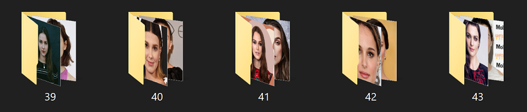

#  Django Web-App
 
Our voting system was developed using Django framework and written both in Python and JS. 
After comparing several web frameworks, we chose to use the Django for the following reasons: 
•	Provides a large range of functionality. 
•	Both for frontend and backend. 
•	Provides Object-relational mapping (ORM) for RDBMS. 
•	Has built-in protection against most common attack vectors: 
<ul>•	Cross-Site Request Forgery (CSRF). 
•	Cross-Site Scripting (XSS). 
•	SQL injection.</ul>
 
Django web application follows the MVT (i.e. Model-View-Template) architecture: 
•	Model: Responsible for the data represented in the database, each model represents a table in the database. 
•	View: Receives HTTP requests and sends HTTP responses. The view is responsible for the logic and mediates between the model and the template. 
•	Template: Responsible for the design (UI components). 
  
 

  
ERD: 

  

1.	Unique code creation 
When a voter is created a vote is automatically created. The vote computes both unique code and party codes for user and is identified by the hashed unique code (not directly associated with the voter).  

2.	Document recognition 
For voter creation it is required to upload an ID scan is needed for its creation. Rather than saving the image scan, the processed through a SNN and the output vector is saved because of security issues.  
When the user uploads a document scan, it is passed to the same SNN and the match is done by calculating the pairwise distance between those vectors.
  
The SNN receives two input images and computes the distance between them. It is trained to reduce distance between a matching pair (i.e. anchor and positives images), while increasing distance between an un-matching pair (i.e. anchor and negative images). 
As our system is an online voting system, both computation time and accuracy are highly important, therefore implemented using EfficientNet-B3 CNN as a backbone: 
•	 Uses a low number of parameters resulting in a lighter and faster model. 
•	Results with decently high accuracy.  

 
Image from EfficientNet: Rethinking Model Scaling for Convolutional Neural Networks  

To define the threshold, the distances between matching and un-matching pairs was computed over the three different document types from test data. 
 
Matching pairs distances (blue) and un-matching pairs distances for (i) ID, (ii) Driving License, (iii) Passport. 

Reached: 
•	98% accuracy for ID documents. 
•	97.7% accuracy for Driving License documents. 
•	98.1% accuracy for Passport documents. 
 
3.	Text verification 
Includes of 3 steps – preprocessing input image, performing OCR and extracting KVPs by computing text similarity. 
(i)	Image preprocessing: 
Performs alignment and increasing text contrast for better performance in OCR. 
(ii)	OCR: 
Using Tesseract OCR, which results with useful information of text recognition. 
(iii)	KVPs extraction: 
Using Tesseract OCR information cluster text to single value differing rows and columns and match to keys by computing Levenshtein distance with key-value pairs from the database. For more precise results, clean values according to matched key and compute again the Levenshtein distance with the true value (this result with not-found values rather than incorrect values for irrelevant matches).  

Similarly to document recognition, To define the threshold the mean distances were computed, for all not-null values, given the different document types from train data (no model was trained over data, could use train data as contains more samples).  

Reached: 
•	91% accuracy for ID documents. 
•	91% accuracy for Driving License documents. 
•	71% accuracy for Passport documents. 
 
4.	Face recognition 
Includes of 2 steps – face detection and face recognition by a SNN model. 
(i)	Face detection: 
Used tinyFaceDetector from face-api JS library.  

(ii)	Face recognition: 
Similarly to document recognition a vector of face image is saved to the database. This face image is extracted from the scanned documents, providing number of faces as the number of documents uploaded. 
For extracting the face from document image used yoloface face detector, after comparing 3 different detectors: 
MTCNN, yoloface and mediapipe. 

  
Number of faces detected in train data over the different detectors, when expected a single face to be detected. 

MTCNN, yoloface and mediapipe detection over a single image.  

For face recognition used a pre-trained model from the deepface library. Initially, chose FaceNet512 as it reached the highest accuracy, but eventually used VGG-Face as FaceNet512 includes Lambda layers that are not compatible with JS. 
 
[Source: Deepface](https://github.com/serengil/deepface)
  

A custom dataset was created to test the face recognition model. As our goal is to recognize a face from the web-cam frame against frontal face images from documents, frontal face images and video frames (mostly from web-cam or phone camera) of celebrities was gathered from Google and YouTube, reaching a total of 1,023,403 images. 

To check the hard cases, the data was grouped by similar celebrities: 

  
Each identity includes image and video directories, with aligned and cropped images: 

 

  
To define the threshold computed cosine distances, where negative image was chosen from similar identity. 

 
(i) FaceNet512 distances (ii) VGG-Face distances  

Reached: 
81% accuracy with FaceNet512 and 70% accuracy with VGG-Face 
