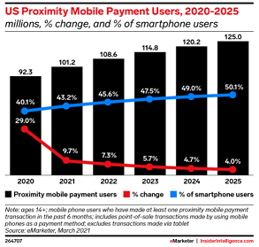
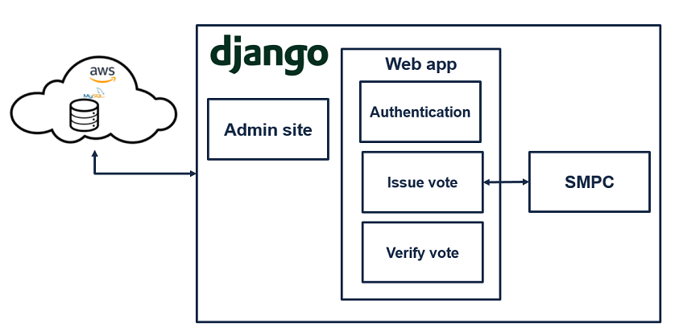

#  OnlineVotingSystem
This project aims to solve up-to-date problems impeding the voting process from evolving to an online manner. 
Online services are constantly growing, even for vulnerable processes, such as payment, leaving the traditional method behind. 

 
[Source: Emarketer](https://www.insiderintelligence.com/content/us-payment-users-will-surpass-100-million-this-year)
  

Online voting system would provide higher accessibility, logistical convenience and accelerate vote counting. 
We terget three main issues online voting systems encounter - authentication, reliability and security. 
 
The authentication process is done similarly to the traditional method and includes an unique code, document verification and face recognition.
Each voter receives a voting note, including it's unique code for signing into the system, he is required to upload a valid document scan (Israeli ID/driving license/passport) which is first recognized by an SNN (i.e. Siamese Neural Network) and then verified by performing OCR (i.e. Optical Character Recognition) and computing text similarity by Levenshtein distance algorithm, against voter's data in DB. Finally face recognition is done by a VGG-Face model using the users webcam. 
Those three processes provide several layers of protection against impersonating. 
 
Additionally to a user's unique code, party codes are computed and included in the voter's note. Those unique codes are computed using both voter's data and unique code, resulting with a unique codes for each party which differ for each voter. In that way the voter may verify his vote and assure it hasn't been altered against the matching code. As the party codes are private and differ for each user, only the note holder is able to verify his vote and it is meaningless to anyone else, providing reliability of the data. 
 
For privacy, we applied SMPC (i.e. Secure Multiparty Computation) protocol for vote counting. After a vote is casted, it is split between two servers and added to the count in an oblivious manner.  
Each server receives a series of bits (a single bit for each party), and only by performing a computation oven both values the true vote can be known. Therefore, the original vote is unknown to each server. 
using randomness, both servers send to each other oblivious data and each server updates it's counting table in a synchronous way so that only using both tables the true counting can be computed, thus both the vote and the counting is unknown without both servers data. 
Another way privacy is provided is by accessing user’s webcam during the voting process, assuring only one person is present in frame by performing face detection. 
 
The system was developed as a web-app using Django framework, written in both Python and JS, integrated with MySQL database (hosted in AWS servers) and the SMPC module, which was written in C++. 
  

For further information check README files in Django webapp and SMPC packages. 
For detailed information check our [project book](https://drive.google.com/file/d/1oNDx6N-JfiyGVEdFe_bm9phu35-I6psx/view?usp=sharing).
