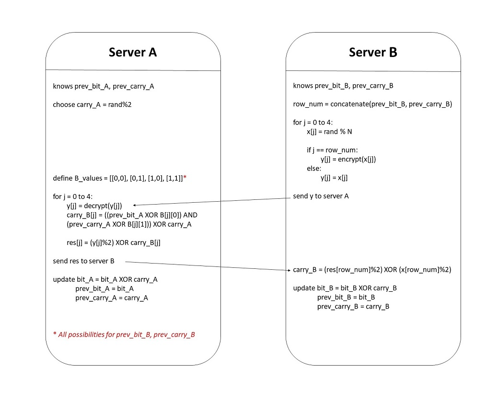

#  SMPC
A POC (i.e. Proof of Concept) for a simple half-adder for binary addition between two servers. 
For a single computer, if a vote was casted to a candidate we add carry[0] = 1 to its count, else we add carry[0] = 0: 
(i)	carry[i+1] = count[i] AND carry[i] 
(ii)	count[i] = count[i] XOR carry[i]  
For two computers, each server holds a counting table and we can get the actual counting by applying XOR over the two counting tables. By ‘splitting’ the vote value to the servers such that carry_A[0] XOR carry_B[0] = carry[0], we get that: 
(iii)	carry[i] = carry_A[i] XOR carry_B[i] 
(iv)	count[i] = count_A[i] XOR count_B[i]  

The idea is that both servers will compute a new counting table, in a manner that preserves the original counting using both tables, by sharing an oblivious information.
We also want to randomly manipulate the entire counting tables, so that no conclusion can be drawn from an update of the counting table. Therefore, after computing the first bit, the carry is chosen randomly. As each bit and carry pair of server B is unknown to server A it computes all possible values of the new carry for server B, depending on its actual values, by using (i), (ii) and (iii): 
carry_A[i+1]  XOR carry_B[i+1]  = (count_A[i] XOR count_B[i]) AND (carry_A[i] XOR carry_B[i]) 
carry_B[i+1] = ((count_A[i] XOR count_B[i]) AND (carry_A[i] XOR carry_B[i])) XOR carry_A[i+1]  

To keep server A data private, server B chooses 4 random numbers and encrypt only the value corresponding to the actual bit_B, carry_B row in table (given by concatenating both bits) and send those values to server A. Server A then decrypts all values and apply XOR with the table results for server B possible carries and send those values to server B. By applying XOR with the random chosen values, server B can extract the computed carry only for the row matching its values (all other values would have no meaning as server A decrypted non-encrypted values). 
In this way, both servers updates their counting tables by sharing oblivious information and keeping each servers data unknown from each other.  

